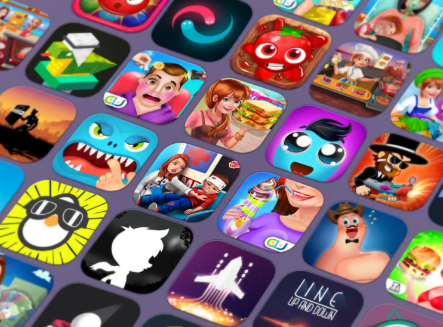

**An NLP Topic Modeling Dashboard Based on Google Play App Reviews**  
---
📱 **Analyze app reviews effortlessly**  
🧠 **Discover dominant topics and insights**  
🎨 **Visualize trends with word clouds**  

Get ready to dive into the world of app reviews and uncover the hidden patterns shaping user feedback. Explore genres, developers, ad impact, and more in one comprehensive platform.

## Folder Overview:

### `data/`
Contains both **raw** and **transformed** data used in the project.  
- **raw**: Original data sources that have not been processed.
- **transformed**: Data that has been cleaned, processed, or modified for the app's dashboard.

### `images/`
Stores images generated during the project, such as **word clouds** and other visualizations.  
- **wordclouds**: Generated word cloud images from NLP model topics.
- Additional visual resources and plots.

### `notebooks_and_model_results/`
Contains Jupyter notebooks and results from model development:  
- **Exploratory Data Analysis (EDA)**: Notebooks for data exploration and visualization.
- **LDA modeling**: Notebooks related to Latent Dirichlet Allocation modeling.
- **Hyperparameter Tuning Results**: Results and analysis from hyperparameter optimization.

### `Scripts/`
Holds Python scripts, including:  
- **Google Play Scraper API**: A script for generating Google Play reviews using an API.

### `app.py`
The **Streamlit** app for showcasing the project’s use of an LDA model and visualizations, enabling interactive use and analysis.
